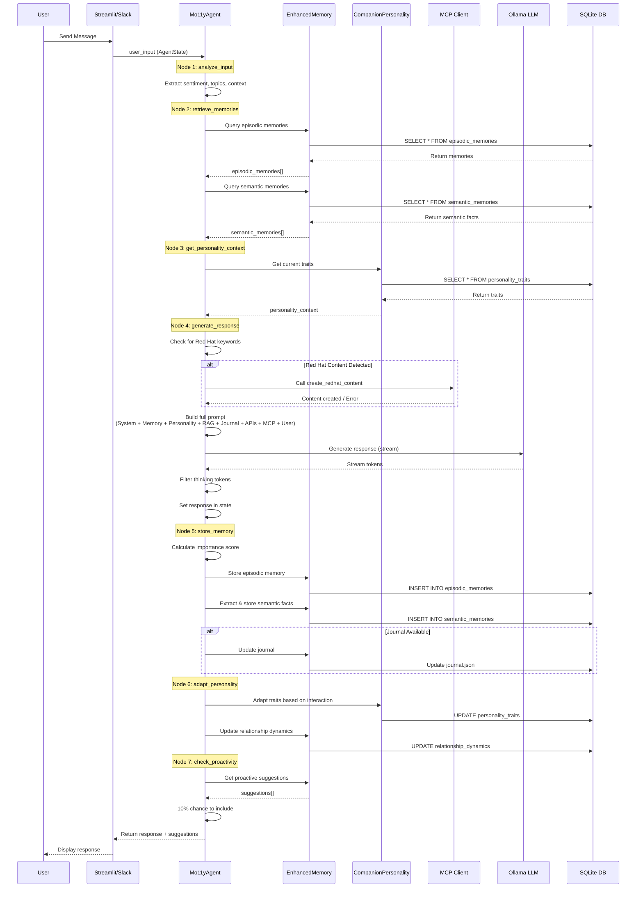
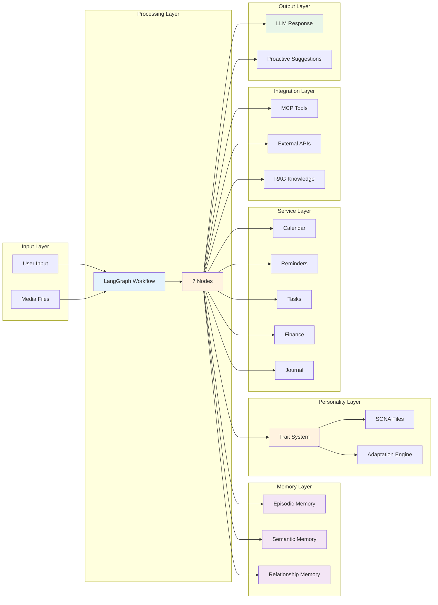
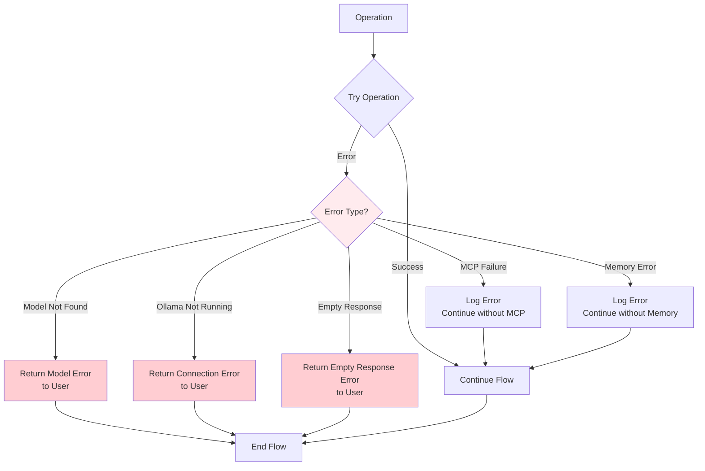

# Mo11y Architecture - LangGraph Flowchart

This document provides a comprehensive LangGraph-style flowchart visualization of the Mo11y architecture, showing the complete system flow from user input to response, including all supporting systems and integrations.

## System Overview

Mo11y is built as a **stateful LangGraph agent** with 7 core nodes that process user interactions through a sophisticated pipeline involving memory retrieval, personality adaptation, and proactive engagement.

## Complete LangGraph Workflow

```mermaid
flowchart TB
    Start([User Input]) --> Entry[Entry Point: analyze_input]
    
    %% Node 1: Analyze Input
    Entry --> Analyze[Node 1: analyze_input]
    Analyze --> |Extract Sentiment| Sentiment[Estimate Sentiment Score<br/>- Positive words: +0.1<br/>- Negative words: -0.1<br/>- Neutral: 0.0]
    Analyze --> |Extract Topics| Topics[Extract Topics/Keywords<br/>- Simple keyword extraction<br/>- Entity detection]
    Analyze --> |Check Media| Media{Has Media Files?}
    Analyze --> |Build Context| Context[Build Context Object<br/>- timestamp<br/>- length<br/>- has_question<br/>- has_exclamation<br/>- topics[]<br/>- media_files[]]
    
    Sentiment --> Context
    Topics --> Context
    Media --> |Yes| MediaContext[Add Media to Context]
    Media --> |No| Context
    MediaContext --> Context
    
    Context --> Retrieve[Node 2: retrieve_memories]
    
    %% Node 2: Retrieve Memories
    Retrieve --> |Query Episodic| Episodic[Recall Episodic Memories<br/>- limit: 5<br/>- min_importance: 0.5<br/>- days_back: 30<br/>- ORDER BY importance_score DESC]
    Retrieve --> |Query Semantic| Semantic[Recall Semantic Memories<br/>- by topics<br/>- limit: 3<br/>- confidence >= 0.7]
    Retrieve --> |Find Related| Related[Find Related Memories<br/>- by tags<br/>- limit: 3]
    
    Episodic --> MemoryBundle[Bundle Memories<br/>- episodic_memories[]<br/>- semantic_memories[]<br/>- related_memories[]]
    Semantic --> MemoryBundle
    Related --> MemoryBundle
    
    MemoryBundle --> Personality[Node 3: get_personality_context]
    
    %% Node 3: Get Personality Context
    Personality --> |Load SONA| LoadSONA[Load Persona File<br/>- name, description<br/>- personality traits<br/>- system_prompt<br/>- rag_file]
    Personality --> |Load Traits| Traits[Get Current Personality Traits<br/>- warmth, playfulness<br/>- empathy, directness<br/>- humor, proactivity<br/>- supportiveness, curiosity]
    Personality --> |Load Summary| RelSummary[Get Relationship Summary<br/>- total_interactions<br/>- relationship_dynamics<br/>- milestones]
    
    LoadSONA --> PersContext[Build Personality Context<br/>- Current traits<br/>- Relationship summary<br/>- Persona description]
    Traits --> PersContext
    RelSummary --> PersContext
    
    PersContext --> Generate[Node 4: generate_response]
    
    %% Node 4: Generate Response
    Generate --> |Check Keywords| RedHatCheck{Red Hat Content<br/>Keywords Detected?<br/>lecture|GE|lab|workshop}
    
    RedHatCheck --> |Yes| ExtractDir[Extract Output Directory<br/>from user input<br/>regex patterns]
    RedHatCheck --> |No| ModelCheck{Model Name Valid?}
    
    ExtractDir --> CallMCP[Call MCP Tool:<br/>create_redhat_content<br/>- request: user_input<br/>- output_dir: extracted]
    
    CallMCP --> MCPResult{MCP Success?}
    
    MCPResult --> |Yes| AddSuccessMsg[Add Success Message<br/>to Context<br/>redhat_content_created]
    MCPResult --> |No| AddErrorMsg[Add Error Message<br/>to Context]
    
    AddSuccessMsg --> ModelCheck
    AddErrorMsg --> ModelCheck
    
    ModelCheck --> |No| ModelError[Return Error Message<br/>Invalid model name]
    ModelCheck --> |Yes| BuildPrompt[Build Full Prompt]
    
    BuildPrompt --> |Include| SystemPrompt[System Prompt<br/>from SONA file<br/>persona.system_prompt]
    BuildPrompt --> |Include| MemoryContext[Memory Context<br/>- Episodic memories<br/>- Semantic facts<br/>- Related context]
    BuildPrompt --> |Include| PersonalityCtx[Personality Context<br/>- Current traits<br/>- Relationship summary]
    BuildPrompt --> |Include| RAGData{RAG Data<br/>Available?<br/>rag_file in SONA}
    BuildPrompt --> |Include| Journal{Journal<br/>Available?<br/>journal_path in SONA}
    BuildPrompt --> |Include| ExternalAPIs{External APIs<br/>Available?<br/>enable_external_apis}
    BuildPrompt --> |Include| MCPTools{MCP Tools<br/>Available?<br/>enable_mcp}
    BuildPrompt --> |Include| UserInput[User Input<br/>+ Media if present]
    
    SystemPrompt --> FullPrompt[Combine into Full Prompt<br/>System + Memory + Personality<br/>+ RAG + Journal + APIs + MCP<br/>+ User Input]
    MemoryContext --> FullPrompt
    PersonalityCtx --> FullPrompt
    RAGData --> |Yes| RAGContext[Add RAG Data Context<br/>from rag_file in SONA<br/>Load JSON knowledge base]
    RAGData --> |No| Journal
    RAGContext --> Journal
    Journal --> |Yes| JournalCtx[Add Journal Context<br/>biographical & business info<br/>from journal.json]
    Journal --> |No| ExternalAPIs
    JournalCtx --> ExternalAPIs
    ExternalAPIs --> |Yes| APIContext[Add External API Context<br/>- Calendar events<br/>- Weather data<br/>- Notes]
    ExternalAPIs --> |No| MCPTools
    APIContext --> MCPTools
    MCPTools --> |Yes| MCPContext[Add MCP Tools Summary<br/>Available tools list<br/>- web_search<br/>- calculator<br/>- file_reader<br/>- image_generator<br/>- etc.]
    MCPTools --> |No| UserInput
    MCPContext --> UserInput
    UserInput --> FullPrompt
    
    FullPrompt --> OllamaCheck{Check Ollama<br/>Connection<br/>localhost:11434}
    
    OllamaCheck --> |Not Connected| OllamaError[Return Connection Error<br/>Ollama not running]
    OllamaCheck --> |Connected| ModelList[Get Available Models<br/>ollama list]
    
    ModelList --> ModelMatch{Model Found?<br/>model_name in list}
    
    ModelMatch --> |No| ModelNotFound[Return Model Not Found Error]
    ModelMatch --> |Yes| TryStream[Try Streaming Response<br/>ollama.chat stream=True]
    
    TryStream --> StreamSuccess{Stream Success?}
    
    StreamSuccess --> |Yes| StreamResponse[Collect Stream Chunks<br/>yield tokens]
    StreamSuccess --> |No| TryNonStream[Try Non-Streaming<br/>ollama.chat stream=False]
    
    StreamResponse --> FilterThinking{Suppress Thinking?<br/>suppress_thinking flag}
    TryNonStream --> NonStreamResponse[Get Non-Stream Response]
    NonStreamResponse --> FilterThinking
    
    FilterThinking --> |Yes| FilterTokens[Filter Thinking Tokens<br/>Remove <think>...</think> blocks<br/>Remove <think> tags]
    FilterThinking --> |No| CheckEmpty{Response Empty?}
    FilterTokens --> CheckEmpty
    
    CheckEmpty --> |Yes| EmptyError[Return Empty Response Error]
    CheckEmpty --> |No| SetResponse[Set Response in State<br/>state['response'] = response]
    
    SetResponse --> Store[Node 5: store_memory]
    
    %% Node 5: Store Memory
    Store --> CalcImportance[Calculate Importance Score<br/>Base: 0.5]
    
    CalcImportance --> |Has Question: +0.1| QuestionBonus[Question Bonus]
    CalcImportance --> |Sentiment: +abs*sentiment*0.2| SentimentBonus[Sentiment Bonus<br/>Note: Used for importance only]
    CalcImportance --> |Long Text: +0.1| LengthBonus[Length Bonus<br/>if len > 100]
    
    QuestionBonus --> FinalImportance[Final Importance Score<br/>clamped 0.0-1.0]
    SentimentBonus --> FinalImportance
    LengthBonus --> FinalImportance
    
    FinalImportance --> StoreEpisodic[Store Episodic Memory<br/>- timestamp<br/>- content: user_input<br/>- context: context JSON<br/>- importance_score<br/>- tags: topics<br/>- relationship_context<br/>NO emotional fields]
    
    StoreEpisodic --> ExtractFacts[Extract Semantic Facts<br/>LLM-based extraction]
    
    ExtractFacts --> |Find I am/I'm| ExtractTraits[Extract User Traits<br/>Pattern matching + LLM]
    ExtractFacts --> |Find I like| ExtractPrefs[Extract Preferences<br/>Pattern matching + LLM]
    
    ExtractTraits --> StoreSemantic[Store Semantic Memories<br/>- key: extracted fact<br/>- value: details<br/>- confidence: 0.8-1.0<br/>- source_memory_id]
    ExtractPrefs --> StoreSemantic
    
    StoreSemantic --> CheckJournal{Journal<br/>Available?}
    
    CheckJournal --> |Yes| UpdateJournal[Update Journal<br/>Extract Biographical & Business Info<br/>from conversation<br/>Update journal.json]
    CheckJournal --> |No| CheckMedia{Has Media?}
    UpdateJournal --> CheckMedia
    
    CheckMedia --> |Yes| StoreMedia[Store Media Memories<br/>Save file paths<br/>Link to episodic memory]
    CheckMedia --> |No| Adapt[Node 6: adapt_personality]
    StoreMedia --> Adapt
    
    %% Node 6: Adapt Personality
    Adapt --> DetermineType[Determine Response Type<br/>from context]
    
    DetermineType --> |Has ! or 😊| HumorType[Humor Appreciated<br/>Increase humor trait]
    DetermineType --> |Length < 50| DirectType[Direct Preferred<br/>Increase directness trait]
    DetermineType --> |Other| NeutralType[Neutral<br/>No specific adaptation]
    
    HumorType --> BuildContext[Build Interaction Context<br/>- response_type<br/>- sentiment<br/>- user_feedback<br/>- communication_style]
    DirectType --> BuildContext
    NeutralType --> BuildContext
    
    BuildContext --> AdaptTraits[Adapt Personality Traits<br/>via personality.adapt_personality<br/>- Adjust trait values<br/>- Update trend<br/>- Increment interaction_count]
    
    AdaptTraits --> UpdateDynamics[Update Relationship Dynamics<br/>- closeness<br/>- trust<br/>- familiarity]
    
    UpdateDynamics --> |Sentiment > 0.5| IncreaseCloseness[Increase Closeness +0.01<br/>Update relationship_dynamics]
    UpdateDynamics --> |Sentiment < -0.5| DecreaseTrust[Decrease Trust -0.01<br/>Update relationship_dynamics]
    UpdateDynamics --> |Other| Proact[Node 7: check_proactivity]
    IncreaseCloseness --> Proact
    DecreaseTrust --> Proact
    
    %% Node 7: Check Proactivity
    Proact --> GetSuggestions[Get Proactive Suggestions<br/>- Topic suggestions<br/>- Memory recalls<br/>- Milestone celebrations]
    
    GetSuggestions --> CheckSuggestions{Suggestions<br/>Available?}
    
    CheckSuggestions --> |No| NoProact[Set should_proact = False<br/>proactivity_suggestions = []]
    CheckSuggestions --> |Yes| RandomCheck{Random < 0.1?<br/>10% Chance}
    
    RandomCheck --> |Yes| SetProact[Set should_proact = True<br/>Include Suggestions<br/>proactivity_suggestions = suggestions]
    RandomCheck --> |No| NoProact
    
    NoProact --> End([END - Return Response<br/>+ Proactive Suggestions])
    SetProact --> End
    ModelError --> End
    OllamaError --> End
    ModelNotFound --> End
    EmptyError --> End
    
    style Start fill:#e1f5ff
    style End fill:#e1f5ff
    style Analyze fill:#fff4e6
    style Retrieve fill:#fff4e6
    style Personality fill:#fff4e6
    style Generate fill:#fff4e6
    style Store fill:#fff4e6
    style Adapt fill:#fff4e6
    style Proact fill:#fff4e6
    style ModelError fill:#ffebee
    style OllamaError fill:#ffebee
    style ModelNotFound fill:#ffebee
    style EmptyError fill:#ffebee
```

## Supporting Systems Architecture

```mermaid
flowchart TB
    subgraph "Mo11y Agent Core"
        Agent[Mo11yAgent<br/>LangGraph State Machine]
        State[AgentState<br/>- user_input<br/>- response<br/>- context<br/>- memories_retrieved<br/>- personality_context<br/>- should_proact<br/>- proactivity_suggestions]
    end
    
    subgraph "Memory System"
        Memory[EnhancedMemory<br/>enhanced_memory.py]
        EpisodicDB[(Episodic Memories<br/>- content, context<br/>- importance_score<br/>- tags, timestamp)]
        SemanticDB[(Semantic Memories<br/>- key, value<br/>- confidence<br/>- source_memory_id)]
        RelDB[(Relationship Milestones<br/>- milestone_type<br/>- description<br/>- significance)]
        PrefDB[(User Preferences<br/>- category, key<br/>- preference_value)]
    end
    
    subgraph "Personality Engine"
        Personality[CompanionPersonality<br/>companion_engine.py]
        TraitsDB[(Personality Traits<br/>- trait_name<br/>- current_value<br/>- trend)]
        CommDB[(Communication Styles<br/>- style_type<br/>- preference_score)]
        DynDB[(Relationship Dynamics<br/>- dynamic_type<br/>- value)]
        SONA[SONA Files<br/>sonas/*.json<br/>- name, description<br/>- personality traits<br/>- system_prompt<br/>- rag_file]
    end
    
    subgraph "Local Services"
        Calendar[LocalCalendar<br/>local_calendar.py]
        Reminder[ReminderService<br/>reminder_service.py]
        Task[TaskService<br/>task_service.py]
        Finance[FinancialService<br/>financial_service.py]
        Journal[Journal<br/>journal.py<br/>journal.json]
    end
    
    subgraph "External Integrations"
        MCP[MCP Client<br/>mcp_integration.py]
        MCPServer[MCP Server<br/>local_mcp_server.py<br/>- web_search<br/>- calculator<br/>- file_reader<br/>- image_generator<br/>- create_redhat_content]
        ExtAPI[External APIs<br/>external_apis.py<br/>- Google Calendar<br/>- Weather API<br/>- Notes]
    end
    
    subgraph "LLM Layer"
        Ollama[Ollama<br/>localhost:11434]
        Models[Models<br/>- deepseek-r1:latest<br/>- llama3.2:3b<br/>- mixtral]
    end
    
    subgraph "User Interfaces"
        Streamlit[Streamlit UI<br/>app_enhanced.py<br/>- Chat Interface<br/>- Relationship Stats<br/>- Memory Vault<br/>- Settings]
        Slack[Slack Bot<br/>slack_bot.py<br/>- Real-time Messaging<br/>- Persona Support]
    end
    
    Agent --> State
    Agent --> Memory
    Agent --> Personality
    Agent --> Calendar
    Agent --> Reminder
    Agent --> Task
    Agent --> Finance
    Agent --> Journal
    Agent --> MCP
    Agent --> ExtAPI
    Agent --> Ollama
    
    Memory --> EpisodicDB
    Memory --> SemanticDB
    Memory --> RelDB
    Memory --> PrefDB
    
    Personality --> TraitsDB
    Personality --> CommDB
    Personality --> DynDB
    Personality --> SONA
    
    MCP --> MCPServer
    
    Ollama --> Models
    
    Streamlit --> Agent
    Slack --> Agent
    
    style Agent fill:#e3f2fd
    style Memory fill:#f3e5f5
    style Personality fill:#fff3e0
    style Ollama fill:#e8f5e9
    style Streamlit fill:#fce4ec
    style Slack fill:#fce4ec
```



## Data Flow Architecture



## Component Interaction Map



## Key Architectural Decisions

### 1. **Stateful LangGraph Architecture**
- **7 sequential nodes** process each user interaction
- **AgentState** flows through all nodes, accumulating context
- **Checkpointing** enables state persistence and recovery

### 2. **Multi-Layered Memory System**
- **Episodic**: Specific events and conversations
- **Semantic**: Extracted facts and knowledge
- **Relationship**: Milestones and dynamics
- **Consolidation**: Old episodic memories → semantic facts

### 3. **Evolving Personality**
- **Traits** adapt based on interaction patterns
- **SONA files** define base personality
- **Relationship dynamics** track closeness and trust

### 4. **Modular Service Integration**
- **Local services**: Calendar, reminders, tasks, finances
- **MCP tools**: Extensible tool system
- **External APIs**: Weather, Google Calendar, notes
- **RAG system**: Knowledge bases from JSON files

### 5. **Proactive Engagement**
- **10% chance** to include proactive suggestions
- **Topic suggestions** based on conversation history
- **Memory recalls** of important past interactions
- **Milestone celebrations** for relationship growth

## State Management

The `AgentState` TypedDict contains:

```python
{
    "messages": List[Dict],           # Conversation history
    "user_input": str,                # Current user message
    "user_sentiment": float,          # Sentiment score (-1 to 1)
    "context": Dict,                  # Extracted context (topics, media, etc.)
    "memories_retrieved": Dict,       # Retrieved memories bundle
    "personality_context": str,       # Formatted personality context
    "response": str,                  # Generated LLM response
    "should_proact": bool,            # Whether to include suggestions
    "proactivity_suggestions": List[str],  # Proactive suggestions
    "interaction_metadata": Dict      # Additional metadata
}
```

## Error Handling Flow



## Integration Points

### MCP Tools Available
- `web_search`: Search the web
- `calculator`: Perform calculations
- `file_reader`: Read files from filesystem
- `image_generator`: Generate images (HuggingFace)
- `create_redhat_content`: Create Red Hat training content
- `textcase`: Text case conversion

### External APIs
- **Google Calendar**: Event management
- **Weather API**: Weather information
- **Notes System**: Persistent notes

### RAG Knowledge Bases
- Loaded from `RAGs/*.json` files
- Referenced in SONA files via `rag_file` field
- Injected into prompt context

### Journal System
- Biographical information extraction
- Business information tracking
- Stored in `journal.json` (per persona)

## Performance Considerations

1. **Memory Retrieval Limits**
   - Episodic: Top 5 by importance (last 30 days)
   - Semantic: Top 3 by relevance
   - Related: Top 3 by tags

2. **Database Optimization**
   - Indexed on `timestamp`, `importance_score`
   - Efficient queries with LIMIT clauses
   - Access tracking for semantic memories

3. **LLM Usage**
   - Streaming responses for better UX
   - Thinking token filtering
   - Context window management

4. **State Checkpointing**
   - Memory-based checkpointing
   - Enables state recovery
   - Supports long-running conversations

---

**Built with LangGraph for stateful, evolving AI companionship**
