# LangGraph Flowchart

This document describes the complete workflow of Mo11y's LangGraph agent architecture.

## Overview

Mo11y uses LangGraph to orchestrate a multi-step conversational workflow that includes input analysis, memory retrieval, personality context, response generation, memory storage, and personality adaptation.

## Complete Flow

```mermaid
flowchart TD
    Start([User Input]) --> Entry[Entry Point: analyze_input]
    
    Entry --> Analyze[Analyze Input Node]
    
    Analyze --> |Extract Sentiment| Sentiment{Estimate Sentiment}
    Analyze --> |Extract Topics| Topics[Extract Topics/Keywords]
    Analyze --> |Check Media| Media{Has Media Files?}
    Analyze --> |Build Context| Context[Build Context Object]
    
    Sentiment --> |Positive Words| PosScore[Positive Score]
    Sentiment --> |Negative Words| NegScore[Negative Score]
    Sentiment --> |Neutral| NeutralScore[Neutral Score]
    
    PosScore --> Context
    NegScore --> Context
    NeutralScore --> Context
    Topics --> Context
    Media --> |Yes| MediaContext[Add Media to Context]
    Media --> |No| Context
    MediaContext --> Context
    
    Context --> Retrieve[Retrieve Memories Node]
    
    Retrieve --> |Get Recent| Episodic[Recall Episodic Memories<br/>limit: 5, min_importance: 0.5, days_back: 30]
    Retrieve --> |Get Semantic| Semantic[Recall Semantic Memories<br/>by topics, limit: 3]
    Retrieve --> |Find Related| Related[Find Related Memories<br/>limit: 3]
    
    Episodic --> MemoryBundle[Bundle Memories]
    Semantic --> MemoryBundle
    Related --> MemoryBundle
    
    MemoryBundle --> Personality[Get Personality Context Node]
    
    Personality --> |Load Traits| Traits[Get Current Personality Traits]
    Personality --> |Load Summary| RelSummary[Get Relationship Summary]
    
    Traits --> PersContext[Build Personality Context]
    RelSummary --> PersContext
    
    PersContext --> Generate[Generate Response Node]
    
    Generate --> |Check Keywords| RedHatCheck{Red Hat Content<br/>Keywords Detected?}
    
    RedHatCheck --> |Yes| ExtractDir[Extract Output Directory<br/>from user input]
    RedHatCheck --> |No| ModelCheck{Model Name Valid?}
    
    ExtractDir --> CallMCP[Call MCP Tool:<br/>create_redhat_content]
    
    CallMCP --> MCPResult{MCP Success?}
    
    MCPResult --> |Yes| AddSuccessMsg[Add Success Message<br/>to Context]
    MCPResult --> |No| AddErrorMsg[Add Error Message<br/>to Context]
    
    AddSuccessMsg --> ModelCheck
    AddErrorMsg --> ModelCheck
    
    ModelCheck --> |No| ModelError[Return Error Message]
    ModelCheck --> |Yes| BuildPrompt[Build Full Prompt]
    
    BuildPrompt --> |Include| SystemPrompt[System Prompt<br/>from SONA file]
    BuildPrompt --> |Include| MemoryContext[Memory Context<br/>episodic + semantic]
    BuildPrompt --> |Include| PersonalityCtx[Personality Context]
    BuildPrompt --> |Include| RAGData{RAG Data<br/>Available?}
    BuildPrompt --> |Include| Journal{Journal<br/>Available?}
    BuildPrompt --> |Include| ExternalAPIs{External APIs<br/>Available?}
    BuildPrompt --> |Include| MCPTools{MCP Tools<br/>Available?}
    BuildPrompt --> |Include| UserInput[User Input]
    
    SystemPrompt --> FullPrompt[Combine into Full Prompt]
    MemoryContext --> FullPrompt
    PersonalityCtx --> FullPrompt
    RAGData --> |Yes| RAGContext[Add RAG Data Context<br/>from rag_file in SONA]
    RAGData --> |No| Journal
    RAGContext --> Journal
    Journal --> |Yes| JournalCtx[Add Journal Context<br/>biographical & business info]
    Journal --> |No| ExternalAPIs
    JournalCtx --> ExternalAPIs
    ExternalAPIs --> |Yes| APIContext[Add External API Context<br/>calendar, weather, notes]
    ExternalAPIs --> |No| MCPTools
    APIContext --> MCPTools
    MCPTools --> |Yes| MCPContext[Add MCP Tools Summary]
    MCPTools --> |No| UserInput
    MCPContext --> UserInput
    UserInput --> FullPrompt
    
    FullPrompt --> OllamaCheck{Check Ollama<br/>Connection}
    
    OllamaCheck --> |Not Connected| OllamaError[Return Connection Error]
    OllamaCheck --> |Connected| ModelList[Get Available Models]
    
    ModelList --> ModelMatch{Model Found?}
    
    ModelMatch --> |No| ModelNotFound[Return Model Not Found Error]
    ModelMatch --> |Yes| TryStream[Try Streaming Response]
    
    TryStream --> StreamSuccess{Stream Success?}
    
    StreamSuccess --> |Yes| StreamResponse[Collect Stream Chunks]
    StreamSuccess --> |No| TryNonStream[Try Non-Streaming]
    
    StreamResponse --> FilterThinking{Suppress Thinking?}
    TryNonStream --> NonStreamResponse[Get Non-Stream Response]
    NonStreamResponse --> FilterThinking
    
    FilterThinking --> |Yes| FilterTokens[Filter Thinking Tokens]
    FilterThinking --> |No| CheckEmpty{Response Empty?}
    FilterTokens --> CheckEmpty
    
    CheckEmpty --> |Yes| EmptyError[Return Empty Response Error]
    CheckEmpty --> |No| SetResponse[Set Response in State]
    
    SetResponse --> Store[Store Memory Node]
    
    Store --> CalcImportance[Calculate Importance Score]
    
    CalcImportance --> |Base: 0.5| BaseScore[Base Importance]
    CalcImportance --> |Has Question: +0.1| QuestionBonus[Question Bonus]
    CalcImportance --> |Sentiment: +abs*sentiment*0.2| SentimentBonus[Sentiment Bonus<br/>Note: Used for importance only]
    CalcImportance --> |Long: +0.1| LengthBonus[Length Bonus]
    
    BaseScore --> FinalImportance[Final Importance Score]
    QuestionBonus --> FinalImportance
    SentimentBonus --> FinalImportance
    LengthBonus --> FinalImportance
    
    FinalImportance --> StoreEpisodic[Store Episodic Memory<br/>No emotional fields stored]
    
    StoreEpisodic --> ExtractFacts[Extract Semantic Facts]
    
    ExtractFacts --> |Find I am/I'm| ExtractTraits[Extract User Traits]
    ExtractFacts --> |Find I like| ExtractPrefs[Extract Preferences]
    
    ExtractTraits --> StoreSemantic[Store Semantic Memories]
    ExtractPrefs --> StoreSemantic
    
    StoreSemantic --> CheckJournal{Journal<br/>Available?}
    
    CheckJournal --> |Yes| UpdateJournal[Update Journal<br/>Extract Biographical & Business Info<br/>from conversation]
    CheckJournal --> |No| CheckMedia{Has Media?}
    UpdateJournal --> CheckMedia
    
    CheckMedia --> |Yes| StoreMedia[Store Media Memories]
    CheckMedia --> |No| Adapt[Adapt Personality Node]
    StoreMedia --> Adapt
    
    Adapt --> DetermineType[Determine Response Type]
    
    DetermineType --> |Has ! or 😊| HumorType[Humor Appreciated]
    DetermineType --> |Length < 50| DirectType[Direct Preferred]
    DetermineType --> |Other| NeutralType[Neutral]
    
    HumorType --> BuildContext[Build Interaction Context]
    DirectType --> BuildContext
    NeutralType --> BuildContext
    
    BuildContext --> AdaptTraits[Adapt Personality Traits<br/>via personality.adapt_personality]
    
    AdaptTraits --> UpdateDynamics[Update Relationship Dynamics]
    
    UpdateDynamics --> |Sentiment > 0.5| IncreaseCloseness[Increase Closeness +0.01]
    UpdateDynamics --> |Sentiment < -0.5| DecreaseTrust[Decrease Trust -0.01]
    UpdateDynamics --> |Other| Proact[Check Proactivity Node]
    IncreaseCloseness --> Proact
    DecreaseTrust --> Proact
    
    Proact --> GetSuggestions[Get Proactive Suggestions]
    
    GetSuggestions --> CheckSuggestions{Suggestions<br/>Available?}
    
    CheckSuggestions --> |No| NoProact[Set should_proact = False]
    CheckSuggestions --> |Yes| RandomCheck{Random < 0.1?<br/>10% Chance}
    
    RandomCheck --> |Yes| SetProact[Set should_proact = True<br/>Include Suggestions]
    RandomCheck --> |No| NoProact
    
    NoProact --> End([END - Return Response])
    SetProact --> End
    ModelError --> End
    OllamaError --> End
    ModelNotFound --> End
    EmptyError --> End
```

## Key Changes from Previous Version

### 1. Red Hat Content Creation Integration
- **Early Detection**: Red Hat content keywords are detected immediately after entering the Generate Response node
- **Directory Extraction**: Output directory is extracted from user input using regex patterns
- **MCP Tool Execution**: The `create_redhat_content` MCP tool is called with the parsed request
- **Context Injection**: Success/error messages are injected into the context before prompt building

### 2. Emotional Support Removal
- **No Emotional Memory Storage**: The episodic memory storage no longer includes `emotional_valence` or `emotional_arousal` fields
- **No Emotional Memory Table**: The `emotional_memories` table has been removed from the database schema
- **Sentiment Still Used**: Sentiment analysis still contributes to importance calculation, but emotional memories are not stored separately

### 3. Journal System (formerly Life Journal)
- **Renamed**: "Life Journal" has been renamed to "Journal"
- **Business Focus**: Journal now focuses on biographical and business information rather than emotional patterns
- **Generic Personas**: Journal is available for any persona, not just specific ones

### 4. Simplified Personality Adaptation
- **Delegated Adaptation**: Personality trait adaptation is now primarily handled by `personality.adapt_personality()` method
- **No Explicit Warmth/Empathy Increases**: The adaptation no longer explicitly increases warmth, supportiveness, or empathy based on sentiment
- **Business-Focused Traits**: Adaptation focuses on business-relevant personality traits

### 5. Updated Importance Calculation
- **Sentiment Contribution**: Sentiment still contributes to importance (`importance += abs(sentiment) * 0.2`)
- **No Emotional Storage**: Despite sentiment being used for importance, emotional memories are not stored

## Node Descriptions

### Analyze Input Node
- Extracts sentiment from user input
- Identifies topics and keywords
- Checks for media attachments
- Builds initial context object

### Retrieve Memories Node
- Recalls recent episodic memories (last 30 days, importance >= 0.5)
- Retrieves semantic memories related to identified topics
- Finds related memories based on context

### Get Personality Context Node
- Loads current personality traits from persona file
- Retrieves relationship summary from memory system
- Builds personality context for prompt

### Generate Response Node
- **Red Hat Content Detection**: Checks for Red Hat content creation keywords
- **MCP Tool Execution**: Calls Red Hat content creation tool if needed
- **Prompt Building**: Constructs full prompt with all available context
- **Model Validation**: Ensures model name is valid
- **Ollama Connection**: Verifies Ollama is running and model is available
- **Response Generation**: Streams or fetches response from Ollama
- **Thinking Token Filtering**: Removes thinking tokens if suppression is enabled

### Store Memory Node
- Calculates importance score (base 0.5 + bonuses)
- Stores episodic memory (without emotional fields)
- Extracts and stores semantic facts (traits, preferences)
- Updates journal if available
- Stores media memories if present

### Adapt Personality Node
- Determines response type (humor, direct, neutral)
- Builds interaction context
- Delegates trait adaptation to personality system
- Updates relationship dynamics (closeness, trust)

### Check Proactivity Node
- Retrieves proactive suggestions
- Randomly decides whether to include suggestions (10% chance)
- Sets `should_proact` flag in state

## State Management

The agent state (`AgentState`) contains:
- `user_input`: Original user message
- `response`: Generated response
- `context`: Extracted context (sentiment, topics, etc.)
- `memories`: Retrieved memories
- `personality_context`: Personality traits and relationship summary
- `redhat_content_created`: Files created by Red Hat content tool (if applicable)
- `should_proact`: Whether to include proactive suggestions

## Error Handling

The flowchart includes error handling for:
- Invalid model names
- Ollama connection failures
- Model not found errors
- Empty responses
- Red Hat content creation failures

## Integration Points

### MCP Tools
- `create_redhat_content`: Creates Red Hat training content (lectures, GEs, labs)
- Other MCP tools can be added and will appear in the MCP Tools Summary

### External APIs
- Calendar integration
- Weather service
- Notes system

### RAG System
- Knowledge bases loaded from persona's `rag_file` configuration
- Contextual information injected into prompts

### Journal System
- Biographical and business information extraction
- Persistent storage in `journal.json`
