# Mo11y LangGraph Workflow - Complete Flow Diagram

This document provides a comprehensive visual map of all interactions and decision points in the Mo11y LangGraph agent workflow.

## Quick Reference: High-Level Flow

```mermaid
graph LR
    A[User Input] --> B[Analyze Input]
    B --> C[Retrieve Memories]
    C --> D[Get Personality]
    D --> E[Generate Response]
    E --> F[Store Memory]
    F --> G[Adapt Personality]
    G --> H[Check Proactivity]
    H --> I[Return Response]
    
    style A fill:#e1f5ff
    style I fill:#ffe1f5
    style E fill:#ffe1e1
```



## Complete Workflow Diagram

```mermaid
flowchart TD
    Start([User Input]) --> Entry[Entry Point: analyze_input]
    
    Entry --> Analyze[Analyze Input Node]
    
    Analyze --> |Extract Sentiment| Sentiment{Estimate Sentiment}
    Analyze --> |Extract Topics| Topics[Extract Topics/Keywords]
    Analyze --> |Check Media| Media{Has Media Files?}
    Analyze --> |Build Context| Context[Build Context Object]
    
    Sentiment --> |Positive Words| PosScore[Positive Score]
    Sentiment --> |Negative Words| NegScore[Negative Score]
    Sentiment --> |Neutral| NeutralScore[Neutral Score]
    
    PosScore --> Context
    NegScore --> Context
    NeutralScore --> Context
    Topics --> Context
    Media --> |Yes| MediaContext[Add Media to Context]
    Media --> |No| Context
    MediaContext --> Context
    
    Context --> Retrieve[Retrieve Memories Node]
    
    Retrieve --> |Get Recent| Episodic[Recall Episodic Memories<br/>limit: 5, min_importance: 0.5, days_back: 30]
    Retrieve --> |Get Semantic| Semantic[Recall Semantic Memories<br/>by topics, limit: 3]
    Retrieve --> |Find Related| Related[Find Related Memories<br/>limit: 3]
    
    Episodic --> MemoryBundle[Bundle Memories]
    Semantic --> MemoryBundle
    Related --> MemoryBundle
    
    MemoryBundle --> Personality[Get Personality Context Node]
    
    Personality --> |Load Traits| Traits[Get Current Personality Traits]
    Personality --> |Load Summary| RelSummary[Get Relationship Summary]
    
    Traits --> PersContext[Build Personality Context]
    RelSummary --> PersContext
    
    PersContext --> Generate[Generate Response Node]
    
    Generate --> |Validate Model| ModelCheck{Model Name Valid?}
    
    ModelCheck --> |No| ModelError[Return Error Message]
    ModelCheck --> |Yes| BuildPrompt[Build Full Prompt]
    
    BuildPrompt --> |Include| SystemPrompt[System Prompt<br/>from SONA file]
    BuildPrompt --> |Include| MemoryContext[Memory Context<br/>episodic + semantic]
    BuildPrompt --> |Include| PersonalityCtx[Personality Context]
    BuildPrompt --> |Include| RAGData{RAG Data<br/>Available?}
    BuildPrompt --> |Include| LifeJournal{Life Journal<br/>Available?}
    BuildPrompt --> |Include| ExternalAPIs{External APIs<br/>Available?}
    BuildPrompt --> |Include| MCPTools{MCP Tools<br/>Available?}
    BuildPrompt --> |Include| UserInput[User Input]
    
    SystemPrompt --> FullPrompt[Combine into Full Prompt]
    MemoryContext --> FullPrompt
    PersonalityCtx --> FullPrompt
    RAGData --> |Yes| RAGContext[Add RAG Data Context<br/>from rag_file in SONA]
    RAGData --> |No| LifeJournal
    RAGContext --> LifeJournal
    LifeJournal --> |Yes| LifeJournalCtx[Add Life Journal Context<br/>Alex Mercer or CJS persona]
    LifeJournal --> |No| ExternalAPIs
    LifeJournalCtx --> ExternalAPIs
    ExternalAPIs --> |Yes| APIContext[Add External API Context<br/>calendar, weather, notes]
    ExternalAPIs --> |No| MCPTools
    APIContext --> MCPTools
    MCPTools --> |Yes| MCPContext[Add MCP Tools Summary]
    MCPTools --> |No| UserInput
    MCPContext --> UserInput
    UserInput --> FullPrompt
    
    FullPrompt --> OllamaCheck{Check Ollama<br/>Connection}
    
    OllamaCheck --> |Not Connected| OllamaError[Return Connection Error]
    OllamaCheck --> |Connected| ModelList[Get Available Models]
    
    ModelList --> ModelMatch{Model Found?}
    
    ModelMatch --> |No| ModelNotFound[Return Model Not Found Error]
    ModelMatch --> |Yes| TryStream[Try Streaming Response]
    
    TryStream --> StreamSuccess{Stream Success?}
    
    StreamSuccess --> |Yes| StreamResponse[Collect Stream Chunks]
    StreamSuccess --> |No| TryNonStream[Try Non-Streaming]
    
    StreamResponse --> FilterThinking{Suppress Thinking?}
    TryNonStream --> NonStreamResponse[Get Non-Stream Response]
    NonStreamResponse --> FilterThinking
    
    FilterThinking --> |Yes| FilterTokens[Filter Thinking Tokens]
    FilterThinking --> |No| CheckEmpty{Response Empty?}
    FilterTokens --> CheckEmpty
    
    CheckEmpty --> |Yes| EmptyError[Return Empty Response Error]
    CheckEmpty --> |No| SetResponse[Set Response in State]
    
    SetResponse --> Store[Store Memory Node]
    
    Store --> CalcImportance[Calculate Importance Score]
    
    CalcImportance --> |Base: 0.5| BaseScore[Base Importance]
    CalcImportance --> |Has Question: +0.1| QuestionBonus[Question Bonus]
    CalcImportance --> |Emotional: +sentiment*0.2| EmotionBonus[Emotion Bonus]
    CalcImportance --> |Long: +0.1| LengthBonus[Length Bonus]
    
    BaseScore --> FinalImportance[Final Importance Score]
    QuestionBonus --> FinalImportance
    EmotionBonus --> FinalImportance
    LengthBonus --> FinalImportance
    
    FinalImportance --> StoreEpisodic[Store Episodic Memory]
    
    StoreEpisodic --> CheckEmotion{Emotion Significant?<br/>abs > 0.3}
    
    CheckEmotion --> |Yes| StoreEmotion[Store Emotional Memory]
    CheckEmotion --> |No| ExtractFacts[Extract Semantic Facts]
    StoreEmotion --> ExtractFacts
    
    ExtractFacts --> |Find I am/I'm| ExtractTraits[Extract User Traits]
    ExtractFacts --> |Find I like| ExtractPrefs[Extract Preferences]
    
    ExtractTraits --> StoreSemantic[Store Semantic Memories]
    ExtractPrefs --> StoreSemantic
    
    StoreSemantic --> CheckLifeJournal{Life Journal<br/>Available?<br/>Alex Mercer or CJS}
    
    CheckLifeJournal --> |Yes| UpdateJournal[Update Life Journal<br/>Extract Biographical Info<br/>from conversation]
    CheckLifeJournal --> |No| CheckMedia{Has Media?}
    UpdateJournal --> CheckMedia
    
    CheckMedia --> |Yes| StoreMedia[Store Media Memories]
    CheckMedia --> |No| Adapt[Adapt Personality Node]
    StoreMedia --> Adapt
    
    Adapt --> DetermineType[Determine Response Type]
    
    DetermineType --> |Has ! or 😊| HumorType[Humor Appreciated]
    DetermineType --> |Length < 50| DirectType[Direct Preferred]
    DetermineType --> |Other| NeutralType[Neutral]
    
    HumorType --> BuildContext[Build Interaction Context]
    DirectType --> BuildContext
    NeutralType --> BuildContext
    
    BuildContext --> AdaptTraits[Adapt Personality Traits]
    
    AdaptTraits --> |Positive Sentiment > 0.5| IncreaseWarmth[Increase Warmth +0.01<br/>Increase Supportiveness +0.01]
    AdaptTraits --> |Negative Sentiment < -0.5| IncreaseEmpathy[Increase Empathy +0.02]
    AdaptTraits --> |Humor Appreciated| IncreaseHumor[Increase Humor +0.01<br/>Increase Playfulness +0.01]
    AdaptTraits --> |Direct Preferred| IncreaseDirect[Increase Directness +0.01]
    
    IncreaseWarmth --> UpdateDynamics[Update Relationship Dynamics]
    IncreaseEmpathy --> UpdateDynamics
    IncreaseHumor --> UpdateDynamics
    IncreaseDirect --> UpdateDynamics
    
    UpdateDynamics --> |Sentiment > 0.5| IncreaseCloseness[Increase Closeness +0.01]
    UpdateDynamics --> |Sentiment < -0.5| DecreaseTrust[Decrease Trust -0.01]
    UpdateDynamics --> |Other| Proact[Check Proactivity Node]
    IncreaseCloseness --> Proact
    DecreaseTrust --> Proact
    
    Proact --> GetSuggestions[Get Proactive Suggestions]
    
    GetSuggestions --> CheckSuggestions{Suggestions<br/>Available?}
    
    CheckSuggestions --> |No| NoProact[Set should_proact = False]
    CheckSuggestions --> |Yes| RandomCheck{Random < 0.1?<br/>10% Chance}
    
    RandomCheck --> |Yes| SetProact[Set should_proact = True<br/>Include Suggestions]
    RandomCheck --> |No| NoProact
    
    NoProact --> End([END - Return Response])
    SetProact --> End
    ModelError --> End
    OllamaError --> End
    ModelNotFound --> End
    EmptyError --> End
    
    style Start fill:#e1f5ff
    style End fill:#ffe1f5
    style Entry fill:#fff4e1
    style Analyze fill:#e1ffe1
    style Retrieve fill:#e1ffe1
    style Personality fill:#e1ffe1
    style Generate fill:#ffe1e1
    style Store fill:#e1e1ff
    style Adapt fill:#ffe1ff
    style Proact fill:#ffffe1
    style ModelError fill:#ffcccc
    style OllamaError fill:#ffcccc
    style ModelNotFound fill:#ffcccc
    style EmptyError fill:#ffcccc
```



## Node Details

### 1. **analyze_input** Node
**Purpose**: Extract sentiment, topics, and context from user input

**Process**:
- Estimates sentiment using keyword matching (positive/negative words)
- Extracts topics by filtering common words
- Checks for media files in interaction metadata
- Builds context object with timestamp, length, questions, topics, media

**Outputs**:
- `user_sentiment`: float (-1.0 to 1.0)
- `context`: dict with metadata

---

### 2. **retrieve_memories** Node
**Purpose**: Find relevant memories for context

**Process**:
- Recalls episodic memories (last 30 days, importance ≥ 0.5, limit 5)
- Recalls semantic memories by topics (top 3 topics)
- Finds related memories (limit 3) if episodic memories exist

**Outputs**:
- `memories_retrieved`: dict with episodic, semantic, related memories

---

### 3. **get_personality_context** Node
**Purpose**: Load current personality state and relationship history

**Process**:
- Gets current personality traits (warmth, playfulness, empathy, etc.)
- Gets relationship summary (interactions, milestones, emotional patterns)
- Combines into personality context string

**Outputs**:
- `personality_context`: string with full personality state

---

### 4. **generate_response** Node
**Purpose**: Generate AI response using LLM

**Process**:
1. Validates model name (handles Model objects, strings, etc.)
   - Checks per-persona model configuration first (from SONA file)
   - Falls back to config.json model_name if not specified
2. Builds full prompt from:
   - System prompt (from SONA file, with system_prompt field if available)
   - Memory context (episodic + semantic)
   - Personality context
   - **RAG data** (if rag_file specified in persona config)
   - **Life journal** (if Alex Mercer or CJS persona, with special context for CJS about "Jim" references)
   - External API context (calendar, weather, notes)
   - MCP tools summary (if available)
   - Conversation history (last 6 messages)
   - User input
3. Checks Ollama connection
4. Gets available models list
5. Matches model name (exact, case-insensitive, partial)
6. Tries streaming first, falls back to non-streaming
7. Filters thinking tokens if enabled (suppress_thinking flag)
8. Validates response is not empty

**Error Paths**:
- Model name invalid → Return error
- Ollama not connected → Return connection error
- Model not found → Return model not found error
- Empty response → Return empty response error

**Outputs**:
- `response`: string with AI response
- `messages`: list with conversation history

---

### 5. **store_memory** Node
**Purpose**: Persist interaction as memory

**Process**:
1. Calculates importance score:
   - Base: 0.5
   - Has question: +0.1
   - Emotional: +sentiment × 0.2
   - Long input (>100 chars): +0.1
2. Stores episodic memory with importance, sentiment, tags
3. Stores emotional memory if significant (abs(sentiment) > 0.3)
4. Extracts semantic facts:
   - "I am/I'm" → user traits
   - "I like" → user preferences
5. Stores semantic memories
6. Updates life journal (if Alex Mercer or CJS persona)
   - Extracts biographical information from conversation
   - Saves to life-journal.json (or custom path from persona config)
7. Stores media memories (if media files attached)
   - Copies files to media directory
   - Generates thumbnails for images
   - Links to episodic memory

**Outputs**:
- Updates database (no state changes)

---

### 6. **adapt_personality** Node
**Purpose**: Evolve personality based on interaction

**Process**:
1. Determines response type:
   - Has "!" or emoji → humor_appreciated
   - Length < 50 → direct_preferred
   - Other → neutral
2. Builds interaction context (sentiment, response_type, topic)
3. Adapts personality traits:
   - Positive sentiment (>0.3) → increase warmth +0.01, supportiveness +0.01
   - Negative sentiment (<-0.3) → increase empathy +0.02
   - Humor appreciated → increase humor +0.01, playfulness +0.01
   - Direct preferred → increase directness +0.01
4. Updates relationship dynamics:
   - Sentiment > 0.5 → increase closeness +0.01
   - Sentiment < -0.5 → decrease trust -0.01

**Outputs**:
- Updates personality database (no state changes)

---

### 7. **check_proactivity** Node
**Purpose**: Decide if proactive engagement is needed

**Process**:
1. Gets proactive suggestions from personality engine
2. Checks if suggestions available
3. Random chance (10%) to proact (to avoid being annoying)
4. Sets should_proact flag and suggestions

**Outputs**:
- `should_proact`: bool
- `proactivity_suggestions`: list of strings

---

## State Flow

```
Agent Initialization
    ↓
Load SONA file (persona config)
    ↓
Load RAG data (if rag_file specified)
    ↓
Load Life Journal (if Alex Mercer or CJS persona)
    ↓
Initialize Memory, Personality, External APIs, MCP
    ↓
━━━━━━━━━━━━━━━━━━━━━━━━━━━━━━━━━━━━━━━━━━━━━━━━━━━━━━━━━━━━━━━━━━━━━━━━━━━━━━━━━━━━━━━━━━━━━━━━━━━━━━━━━━━━━━━━━━━━━━━━━━━━━━━━━━━━━━━━━━━━━━━━━━━━━━━━━━━━━━━━━━━━━━━━━━━━━━━━━━━━━━━━━━━━━━━━━━━━━━━━━━━━━━━━━━━━━━━━━━━━━━━━━━━━━━━━━━━━━━━━━━━━━━━━━━━━━━━━━━━━━━━━━━━━━━━━━━━━━━━━━━━━━━━━━━━━━━━━━━━━━━━━━━━━━━━━━━━━━━━━━━━━━━━━━━━━━━━━━━━━━━━━━━━━━━━━━━━━━━━━━━━━━━━━━━━━━━━━━━━━━━━━━━━━━━━━━━━━━━━━━━━━━━━━━━━━━━━━━━━━━━━━━━━━━━━━━━━━━━━━━━━━━━━━━━━━━━━━━━━━━━━━━━━━━━━━━━━━━━━━━━━━━━━━━━━━━━━━━━━━━━━━━━━━━━━━━━━━━━━━━━━━━━━━━━━━━━━━━━━━━━━━━━━━━━━━━━━━━━━━━━━━━━━━━━━━━━━━━━━━━━━━━━━━━━━━━━━━━━━━━━━━━━━━━━━━━━━━━━━━━━━━━━━━━━━━━━━━━━━━━━━━━━━━━━━━━━━━━━━━━━━━━━━━━━━━━━━━━━━━━━━━━━━━━━━━━━━━━━━━━━━━━━━━━━━━━━━━━━━━━━━━━━━━━━━━━━━━━━━━━━━━━━━━━━━━━━━━━━━━━━━━━━━━━━━━━━━━━━━━━━━━━━━━━━━━━━━━━━━━━━━━━━━━━━━━━━━━━━━━━━━━━━━━━━━━━━━━━━━━━━━━━━━━━━━━━━━━━━━━━━━━━━━━━━━━━━━━━━━━━━━━━━━━━━━━━━━━━━━━━━━━━━━━━━━━━━━━━━━━━━━━━━━━━━━━━━━━━━━━━━━━━━━━━━━━━━━━━━━━━━━━━━━━━━━━━━━━━━━━━━━━━━━━━━━━━━━━━━━━━━━━━━━━━━━━━━━━━━━━━━━━━━━━━━━━━━━━━━━━━━━━━━━━━━━━━━━━━━━━━━━━━━━━━━━━━━━━━━━━━━━━━━━━━━━━━━━━━━━━━━━━━━━━━━━━━━━━━━━━━━━━━━━━━━━━━━━━━━━━━━━━━━━━━━━━━━━━━━━━━━━━━━━━━━━━━━━━━━━━━━━━━━━━━━━━━━━━━━━━━━━━━━━━━━━━━━━━━━━━━━━━━━━━━━━━━━━━━━━━━━━━━━━━━━━━━━━━━━━━━━━━━━━━━━━━━━━━━━━━━━━━━━━━━━━━━━━━━━━━━━━━━━━━━━━━━━━━━━━━━━━━━━━━━━━━━━━━━━━━━━━━━━━━━━━━━━━━━━━━━━━━━━━━━━━━━━━━━━━━━━━━━━━━━━━━━━━━━━━━━━━━━━━━━━━━━━━━━━━━━━━━━━━━━━━━━━━━━━━━━━━━━━━━━━━━━━━━━━━━━━━━━━━━━━━━━━━━━━━━━━━━━━━━━━━━━━━━━━━━━━━━━━━━━━━━━━━━━━━━━━━━━━━━━━━━━━━━━━━━━━━━━━━━━━━━━━━━━━━━━━━━━━━━━━━━━━━━━━━━━━━━━━━━━━━━━━━━━━━━━━━━━━━━━━━━━━━━━━━━━━━━━━━━━━━━━━━━━━━━━━━━━━━━━━━━━━━━━━━━━━━━━━━━━━━━━━━━━━━━━━━━━━━━━━━━━━━━━━━━━━━━━━━━━━━━━━━━━━━━━━━━━━━━━━━━━━━━━━━━━━━━━━━━━━━━━━━━━━━━━━━━━━━━━━━━━━━━━━━━━━━━━━━━━━━━━━━━━━━━━━━━━━━━━━━━━━━━━━━━━━━━━━━━━━━━━━━━━━━━━━━━━━━━━━━━━━━━━━━━━━━━━━━━━━━━━━━━━━━━━━━━━━━━━━━━━━━━━━━━━━━━━━━━━━━━━━━━━━━━━━━━━━━━━━━━━━━━━━━━━━━━━━━━━━━━━━━━━━━━━━━━━━━━━━━━━━━━━━━━━━━━━━━━━━━━━━━━━━━━━━━━━━━━━━━━━━━━━━━━━━━━━━━━━━━━━━━━━━━━━━━━━━━━━━━━━━━━━━━━━━━━━━━━━━━━━━━━━━━━━━━━━━━━━━━━━━━━━━━━━━━━━━━━━━━━━━━━━━━━━━━━━━━━━━━━━━━━━━━━━━━━━━━━━━━━━━━━━━━━━━━━━━━━━━━━━━━━━━━━━━━━━━━━━━━━━━━━━━━━━━━━━━━━━━━━━━━━━━━━━━━━━━━━━━━━━━━━━━━━━━━━━━━━━━━━━━━━━━━━━━━━━━━━━━━━━━━━━━━━━━━━━━━━━━━━━━━━━━━━━━━━━━━━━━━━━━━━━━━━━━━━━━━━━━━━━━━━━━━━━━━━━━━━━━━━━━━━━━━━━━━━━━━━━━━━━━━━━━━━━━━━━━━━━━━━━━━━━━━━━━━━━━━━━━━━━━━━━━━━━━━━━━━━━━━━━━━━━━━━━━━━━━━━━━━━━━━━━━━━━━━━━━━━━━━━━━━━━━━━━━━━━━━━━━━━━━━━━━━━━━━━━━━━━━━━━━━━━━━━━━━━━━━━━━━━━━━━━━━━━━━━━━━━━━━━━━━━━━━━━━━━━━━━━━━━━━━━━━━━━━━━━━━━━━━━━━━━━━━━━━━━━━━━━━━━━━━━━━━━━━━━━━━━━━━━━━━━━━━━━━━━━━━━━━━━━━━━━━━━━━━━━━━━━━━━━━━━━━━━━━━━━━━━━━━━━━━━━━━━━━━━━━━━━━━━━━━━━━━━━━━━━━━━━━━━━━━━━━━━━━━━━━━━━━━━━━━━━━━━━━━━━━━━━━━━━━━━━━━━━━━━━━━━━━━━━━━━━━━━━━━━━━━━━━━━━━━━━━━━━━━━━━━━━━━━━━━━━━━━━━━━━━━━━━━━━━━━━━━━━━━━━━━━━━━━━━━━━━━━━━━━━━━━━━━━━━━━━━━━━━━━━━━━━━━━━━━━━━━━━━━━━━━━━━━━━━━━━━━━━━━━━━━━━━━━━━━━━━━━━━━━━━━━━━━━━━━━━━━━━━━━━━━━━━━━━━━━━━━━━━━━━━━━━━━━━━━━━━━━━━━━━━━━━━━━━━━━━━━━━━━━━━━━━━━━━━━━━━━━━━━━━━━━━━━━━━━━━━━━━━━━━━━━━━━━━━━━━━━━━━━━━━━━━━━━━━━━━━━━━━━━━━━━━━━━━━━━━━━━━━━━━━━━━━━━━━━━━━━━━━━━━━━━━━━━━━━━━━━━━━━━━━━━━━━━━━━━━━━━━━━━━━━━━━━━━━━━━━━━━━━━━━━━━━━━━━━━━━━━━━━━━━━━━━━━━━━━━━━━━━━━━━━━━━━━━━━━━━━━━━━━━━━━━━━━━━━━━━━━━━━━━━━━━━━━━━━━━━━━━━━━━━━━━━━━━━━━━━━━━━━━━━━━━━━━━━━━━━━━━━━━━━━━━━━━━━━━━━━━━━━━━━━━━━━━━━━━━━━━━━━━━━━━━━━━━━━━━━━━━━━━━━━━━━━━━━━━━━━━━━━━━━━━━━━━━━━━━━━━━━━━━━━━━━━━━━━━━━━━━━━━━━━━━━━━━━━━━━━━━━━━━━━━━━━━━━━━━━━━━━━━━━━━━━━━━━━━━━━━━━━━━━━━━━━━━━━━━━━━━━━━━━━━━━━━━━━━━━━━━━━━━━━━━━━━━━━━━━━━━━━━━━━━━━━━━━━━━━━━━━━━━━━━━━━━━━━━━━━━━━━━━━━━━━━━━━━━━━━━━━━━━━━━━━━━━━━━━━━━━━━━━━━━━━━━━━━━━━━━━━━━━━━━━━━━━━━━━━━━━━━━━━━━━━━━━━━━━━━━━━━━━━━━━━━━━━━━━━━━━━━━━━━━━━━━━━━━━━━━━━━━━━━━━━━━━━━━━━━━━━━━━━━━━━━━━━━━━━━━━━━━━━━━━━━━━━━━━━━━━━━━━━━━━━━━━━━━━━━━━━━━━━━━━━━━━━━━━━━━━━━━━━━━━━━━━━━━━━━━━━━━━━━━━━━━━━━━━━━━━━━━━━━━━━━━━━━━━━━━━━━━━━━━━━━━━━━━━━━━━━━━━━━━━━━━━━━━━━━━━━━━━━━━━━━━━━━━━━━━━━━━━━━━━━━━━━━━━━━━━━━━━━━━━━━━━━━━━━━━━━━━━━━━━━━━━━━━━━━━━━━━━━━━━━━━━━━━━━━━━━━━━━━━━━━━━━━━━━━━━━━━━━━━━━━━━━━━━━━━━━━━━━━━━━━━━━━━━━━━━━━━━━━━━━━━━━━━━━━━━━━━━━━━━━━━━━━━━━━━━━━━━━━━━━━━━━━━━━━━━━━━━━━━━━━━━━━━━━━━━━━━━━━━━━━━━━━━━━━━━━━━━━━━━━━━━━━━━━━━━━━━━━━━━━━━━━━━━━━━━━━━━━━━━━━━━━━━━━━━━━━━━━━━━━━━━━━━━━━━━━━━━━━━━━━━━━━━━━━━━━━━━━━━━━━━━━━━━━━━━━━━━━━━━━━━━━━━━━━━━━━━━━━━━━━━━━━━━━━━━━━━━━━━━━━━━━━━━━━━━━━━━━━━━━━━━━━━━━━━━━━━━━━━━━━━━━━━━━━━━━━━━━━━━━━━━━━━━━━━━━━━━━━━━━━━━━━━━━━━━━━━━━━━━━━━━━━━━━━━━━━━━━━━━━━━━━━━━━━━━━━━━━━━━━━━━━━━━━━━━━━━━━━━━━━━━━━━━━━━━━━━━━━━━━━━━━━━━━━━━━━━━━━━━━━━━━━━━━━━━━━━━━━━━━━━━━━━━━━━━━━━━━━━━━━━━━━━━━━━━━━━━━━━━━━━━━━━━━━━━━━━━━━━━━━━━━━━━━━━━━━━━━━━━━━━━━━━━━━━━━━━━━━━━━━━━━━━━━━━━━━━━━━━━━━━━━━━━━━━━━━━━━━━━━━━━━━━━━━━━━━━━━━━━━━━━━━━━━━━━━━━━━━━━━━━━━━━━━━━━━━━━━━━━━━━━━━━━━━━━━━━━━━━━━━━━━━━━━━━━━━━━━━━━━━━━━━━━━━━━━━━━━━━━━━━━━━━━━━━━━━━━━━━━━━━━━━━━━━━━━━━━━━━━━━━━━━━━━━━━━━━━━━━━━━━━━━━━━━━━━━━━━━━━━━━━━━━━━━━━━━━━━━━━━━━━━━━━━━━━━━━━━━━━━━━━━━━━━━━━━━━━━━━━━━━━━━━━━━━━━━━━━━━━━━━━━━━━━━━━━━━━━━━━━━━━━━━━━━━━━━━━━━━━━━━━━━━━━━━━━━━━━━━━━━━━━━━━━━━━━━━━━━━━━━━━━━━━━━━━━━━━━━━━━━━━━━━━━━━━━━━━━━━━━━━━━━━━━━━━━━━━━━━━━━━━━━━━━━━━━━━━━━━━━━━━━━━━━━━━━━━━━━━━━━━━━━━━━━━━━━━━━━━━━━━━━━━━━━━━━━━━━━━━━━━━━━━━━━━━━━━━━━━━━━━━━━━━━━━━━━━━━━━━━━━━━━━━━━━━━━━━━━━━━━━━━━━━━━━━━━━━━━━━━━━━━━━━━━━━━━━━━━━━━━━━━━━━━━━━━━━━━━━━━━━━━━━━━━━━━━━━━━━━━━━━━━━━━━━━━━━━━━━━━━━━━━━━━━━━━━━━━━━━━━━━━━━━━━━━━━━━━━━━━━━━━━━━━━━━━━━━━━━━━━━━━━━━━━━━━━━━━━━━━━━━━━━━━━━━━━━━━━━━━━━━━━━━━━━━━━━━━━━━━━━━━━━━━━━━━━━━━━━━━━━━━━━━━━━━━━━━━━━━━━━━━━━━━━━━━━━━━━━━━━━━━━━━━━━━━━━━━━━━━━━━━━━━━━━━━━━━━━━━━━━━━━━━━━━━━━━━━━━━━━━━━━━━━━━━━━━━━━━━━━━━━━━━━━━━━━━━━━━━━━━━━━━━━━━━━━━━━━━━━━━━━━━━━━━━━━━━━━━━━━━━━━━━━━━━━━━━━━━━━━━━━━━━━━━━━━━━━━━━━━━━━━━━━━━━━━━━━━━━━━━━━━━━━━━━━━━━━━━━━━━━━━━━━━━━━━━━━━━━━━━━━━━━━━━━━━━━━━━━━━━━━━━━━━━━━━━━━━━━━━━━━━━━━━━━━━━━━━━━━━━━━━━━━━━━━━━━━━━━━━━━━━━━━━━━━━━━━━━━━━━━━━━━━━━━━━━━━━━━━━━━━━━━━━━━━━━━━━━━━━━━━━━━━━━━━━━━━━━━━━━━━━━━━━━━━━━━━━━━━━━━━━━━━━━━━━━━━━━━━━━━━━━━━━━━━━━━━━━━━━━━━━━━━━━━━━━━━━━━━━━━━━━━━━━━━━━━━━━━━━━━━━━━━━━━━━━━━━━━━━━━━━━━━━━━━━━━━━━━━━━━━━━━━━━━━━━━━━━━━━━━━━━━━━━━━━━━━━━━━━━━━━━━━━━━━━━━━━━━━━━━━━━━━━━━━━━━━━━━━━━━━━━━━━━━━━━━━━━━━━━━━━━━━━━━━━━━━━━━━━━━━━━━━━━━━━━━━━━━━━━━━━━━━━━━━━━━━━━━━━━━━━━━━━━━━━━━━━━━━━━━━━━━━━━━━━━━━━━━━━━━━━━━━━━━━━━━━━━━━━━━━━━━━━━━━━━━━━━━━━━━━━━━━━━━━━━━━━━━━━━━━━━━━━━━━━━━━━━━━━━━━━━━━━━━━━━━━━━━━━━━━━━━━━━━━━━━━━━━━━━━━━━━━━━━━━━━━━━━━━━━━━━━━━━━━━━━━━━━━━━━━━━━━━━━━━━━━━━━━━━━━━━━━━━━━━━━━━━━━━━━━━━━━━━━━━━━━━━━━━━━━━━━━━━━━━━━━━━━━━━━━━━━━━━━━━━━━━━━━━━━━━━━━━━━━━━━━━━━━━━━━━━━━━━━━━━━━━━━━━━━━━━━━━━━━━━━━━━━━━━━━━━━━━━━━━━━━━━━━━━━━━━━━━━━━━━━━━━━━━━━━━━━━━━━━━━━━━━━━━━━━━━━━━━━━━━━━━━━━━━━━━━━━━━━━━━━━━━━━━━━━━━━━━━━━━━━━━━━━━━━━━━━━━━━━━━━━━━━━━━━━━━━━━━━━━━━━━━━━━━━━━━━━━━━━━━━━━━━━━━━━━━━━━━━━━━━━━━━━━━━━━━━━━━━━━━━━━━━━━━━━━━━━━━━━━━━━━━━━━━━━━━━━━━━━━━━━━━━━━━━━━━━━━━━━━━━━━━━━━━━━━━━━━━━━━━━━━━━━━━━━━━━━━━━━━━━━━━━━━━━━━━━━━━━━━━━━━━━━━━━━━━━━━━━━━━━━━━━━━━━━━━━━━━━━━━━━━━━━━━━━━━━━━━━━━━━━━━━━━━━━━━━━━━━━━━━━━━━━━━━━━━━━━━━━━━━━━━━━━━━━━━━━━━━━━━━━━━━━━━━━━━━━━━━━━━━━━━━━━━━━━━━━━━━━━━━━━━━━━━━━━━━━━━━━━━━━━━━━━━━━━━━━━━━━━━━━━━━━━━━━━━━━━━━━━━━━━━━━━━━━━━━━━━━━━━━━━━━━━━━━━━━━━━━━━━━━━━━━━━━━━━━━━━━━━━━━━━━━━━━━━━━━━━━━━━━━━━━━━━━━━━━━━━━━━━━━━━━━━━━━━━━━━━━━━━━━━━━━━━━━━━━━━━━━━━━━━━━━━━━━━━━━━━━━━━━━━━━━━━━━━━━━━━━━━━━━━━━━━━━━━━━━━━━━━━━━━━━━━━━━━━━━━━━━━━━━━━━━━━━━━━━━━━━━━━━━━━━━━━━━━━━━━━━━━━━━━━━━━━━━━━━━━━━━━━━━━━━━━━━━━━━━━━━━━━━━━━━━━━━━━━━━━━━━━━━━━━━━━━━━━━━━━━━━━━━━━━━━━━━━━━━━━━━━━━━━━━━━━━━━━━━━━━━━━━━━━━━━━━━━━━━━━━━━━━━━━━━━━━━━━━━━━━━━━━━━━━━━━━━━━━━━━━━━━━━━━━━━━━━━━━━━━━━━━━━━━━━━━━━━━━━━━━━━━━━━━━━━━━━━━━━━━━━━━━━━━━━━━━━━━━━━━━━━━━━━━━━━━━━━━━━━━━━━━━━━━━━━━━━━━━━━━━━━━━━━━━━━━━━━━━━━━━━━━━━━━━━━━━━━━━━━━━━━━━━━━━━━━━━━━━━━━━━━━━━━━━━━━━━━━━━━━━━━━━━━━━━━━━━━━━━━━━━━━━━━━━━━━━━━━━━━━━━━━━━━━━━━━━━━━━━━━━━━━━━━━━━━━━━━━━━━━━━━━━━━━━━━━━━━━━━━━━━━━━━━━━━━━━━━━━━━━━━━━━━━━━━━━━━━━━━━━━━━━━━━━━━━━━━━━━━━━━━━━━━━━━━━━━━━━━━━━━━━━━━━━━━━━━━━━━━━━━━━━━━━━━━━━━━━━━━━━━━━━━━━━━━━━━━━━━━━━━━━━━━━━━━━━━━━━━━━━━━━━━━━━━━━━━━━━━━━━━━━━━━━━━━━━━━━━━━━━━━━━━━━━━━━━━━━━━━━━━━━━━━━━━━━━━━━━━━━━━━━━━━━━━━━━━━━━━━━━━━━━━━━━━━━━━━━━━━━━━━━━━━━━━━━━━━━━━━━━━━━━━━━━━━━━━━━━━━━━━━━━━━━━━━━━━━━━━━━━━━━━━━━━━━━━━━━━━━━━━━━━━━━━━━━━━━━━━━━━━━━━━━━━━━━━━━━━━━━━━━━━━━━━━━━━━━━━━━━━━━━━━━━━━━━━━━━━━━━━━━━━━━━━━━━━━━━━━━━━━━━━━━━━━━━━━━━━━━━━━━━━━━━━━━━━━━━━━━━━━━━━━━━━━━━━━━━━━━━━━━━━━━━━━━━━━━━━━━━━━━━━━━━━━━━━━━━━━━━━━━━━━━━━━━━━━━━━━━━━━━━━━━━━━━━━━━━━━━━━━━━━━━━━━━━━━━━━━━━━━━━━━━━━━━━━━━━━━━━━━━━━━━━━━━━━━━━━━━━━━━━━━━━━━━━━━━━━━━━━━━━━━━━━━━━━━━━━━━━━━━━━━━━━━━━━━━━━━━━━━━━━━━━━━━━━━━━━━━━━━━━━━━━━━━━━━━━━━━━━━━━━━━━━━━━━━━━━━━━━━━━━━━━━━━━━━━━━━━━━━━━━━━━━━━━━━━━━━━━━━━━━━━━━━━━━━━━━━━━━━━━━━━━━━━━━━━━━━━━━━━━━━━━━━━━━━━━━━━━━━━━━━━━━━━━━━━━━━━━━━━━━━━━━━━━━━━━━━━━━━━━━━━━━━━━━━━━━━━━━━━━━━━━━━━━━━━━━━━━━━━━━━━━━━━━━━━━━━━━━━━━━━━━━━━━━━━━━━━━━━━━━━━━━━━━━━━━━━━━━━━━━━━━━━━━━━━━━━━━━━━━━━━━━━━━━━━━━━━━━━━━━━━━━━━━━━━━━━━━━━━━━━━━━━━━━━━━━━━━━━━━━━━━━━━━━━━━━━━━━━━━━━━━━━━━━━━━━━━━━━━━━━━━━━━━━━━━━━━━━━━━━━━━━━━━━━━━━━━━━━━━━━━━━━━━━━━━━━━━━━━━━━━━━━━━━━━━━━━━━━━━━━━━━━━━━━━━━━━━━━━━━━━━━━━━━━━━━━━━━━━━━━━━━━━━━━━━━━━━━━━━━━━━━━━━━━━━━━━━━━━━━━━━━━━━━━━━━━━━━━━━━━━━━━━━━━━━━━━━━━━━━━━━━━━━━━━━━━━━━━━━━━━━━━━━━━━━━━━━━━━━━━━━━━━━━━━━━━━━━━━━━━━━━━━━━━━━━━━━━━━━━━━━━━━━━━━━━━━━━━━━━━━━━━━━━━━━━━━━━━━━━━━━━━━━━━━━━━━━━━━━━━━━━━━━━━━━━━━━━━━━━━━━━━━━━━━━━━━━━━━━━━━━━━━━━━━━━━━━━━━━━━━━━━━━━━━━━━━━━━━━━━━━━━━━━━━━━━━━━━━━━━━━━━━━━━━━━━━━━━━━━━━━━━━━━━━━━━━━━━━━━━━━━━━━━━━━━━━━━━━━━━━━━━━━━━━━━━━━━━━━━━━━━━━━━━━━━━━━━━━━━━━━━━━━━━━━━━━━━━━━━━━━━━━━━━━━━━━━━━━━━━━━━━━━━━━━━━━━━━━━━━━━━━━━━━━━━━━━━━━━━━━━━━━━━━━━━━━━━━━━━━━━━━━━━━━━━━━━━━━━━━━━━━━━━━━━━━━━━━━━━━━━━━━━━━━━━━━━━━━━━━━━━━━━━━━━━━━━━━━━━━━━━━━━━━━━━━━━━━━━━━━━━━━━━━━━━━━━━━━━━━━━━━━━━━━━━━━━━━━━━━━━━━━━━━━━━━━━━━━━━━━━━━━━━━━━━━━━━━━━━━━━━━━━━━━━━━━━━━━━━━━━━━━━━━━━━━━━━━━━━━━━━━━━━━━━━━━━━━━━━━━━━━━━━━━━━━━━━━━━━━━━━━━━━━━━━━━━━━━━━━━━━━━━━━━━━━━━━━━━━━━━━━━━━━━━━━━━━━━━━━━━━━━━━━━━━━━━━━━━━━━━━━━━━━━━━━━━━━━━━━━━━━━━━━━━━━━━━━━━━━━━━━━━━━━━━━━━━━━━━━━━━━━━━━━━━━━━━━━━━━━━━━━━━━━━━━━━━━━━━━━━━━━━━━━━━━━━━━━━━━━━━━━━━━━━━━━━━━━━━━━━━━━━━━━━━━━━━━━━━━━━━━━━━━━━━━━━━━━━━━━━━━━━━━━━━━━━━━━━━━━━━━━━━━━━━━━━━━━━━━━━━━━━━━━━━━━━━━━━━━━━━━━━━━━━━━━━━━━━━━━━━━━━━━━━━━━━━━━━━━━━━━━━━━━━━━━━━━━━━━━━━━━━━━━━━━━━━━━━━━━━━━━━━━━━━━━━━━━━━━━━━━━━━━━━━━━━━━━━━━━━━━━━━━━━━━━━━━━━━━━━━━━━━━━━━━━━━━━━━━━━━━━━━━━━━━━━━━━━━━━━━━━━━━━━━━━━━━━━━━━━━━━━━━━━━━━━━━━━━━━━━━━━━━━━━━━━━━━━━━━━━━━━━━━━━━━━━━━━━━━━━━━━━━━━━━━━━━━━━━━━━━━━━━━━━━━━━━━━━━━━━━━━━━━━━━━━━━━━━━━━━━━━━━━━━━━━━━━━━━━━━━━━━━━━━━━━━━━━━━━━━━━━━━━━━━━━━━━━━━━━━━━━━━━━━━━━━━━━━━━━━━━━━━━━━━━━━━━━━━━━━━━━━━━━━━━━━━━━━━━━━━━━━━━━━━━━━━━━━━━━━━━━━━━━━━━━━━━━━━━━━━━━━━━━━━━━━━━━━━━━━━━━━━━━━━━━━━━━━━━━━━━━━━━━━━━━━━━━━━━━━━━━━━━━━━━━━━━━━━━━━━━━━━━━━━━━━━━━━━━━━━━━━━━━━━━━━━━━━━━━━━━━━━━━━━━━━━━━━━━━━━━━━━━━━━━━━━━━━━━━━━━━━━━━━━━━━━━━━━━━━━━━━━━━━━━━━━━━━━━━━━━━━━━━━━━━━━━━━━━━━━━━━━━━━━━━━━━━━━━━━━━━━━━━━━━━━━━━━━━━━━━━━━━━━━━━━━━━━━━━━━━━━━━━━━━━━━━━━━━━━━━━━━━━━━━━━━━━━━━━━━━━━━━━━━━━━━━━━━━━━━━━━━━━━━━━━━━━━━━━━━━━━━━━━━━━━━━━━━━━━━━━━━━━━━━━━━━━━━━━━━━━━━━━━━━━━━━━━━━━━━━━━━━━━━━━━━━━━━━━━━━━━━━━━━━━━━━━━━━━━━━━━━━━━━━━━━━━━━━━━━━━━━━━━━━━━━━━━━━━━━━━━━━━━━━━━━━━━━━━━━━━━━━━━━━━━━━━━━━━━━━━━━━━━━━━━━━━━━━━━━━━━━━━━━━━━━━━━━━━━━━━━━━━━━━━━━━━━━━━━━━━━━━━━━━━━━━━━━━━━━━━━━━━━━━━━━━━━━━━━━━━━━━━━━━━━━━━━━━━━━━━━━━━━━━━━━━━━━━━━━━━━━━━━━━━━━━━━━━━━━━━━━━━━━━━━━━━━━━━━━━━━━━━━━━━━━━━━━━━━━━━━━━━━━━━━━━━━━━━━━━━━━━━━━━━━━━━━━━━━━━━━━━━━━━━━━━━━━━━━━━━━━━━━━━━━━━━━━━━━━━━━━━━━━━━━━━━━━━━━━━━━━━━━━━━━━━━━━━━━━━━━━━━━━━━━━━━━━━━━━━━━━━━━━━━━━━━━━━━━━━━━━━━━━━━━━━━━━━━━━━━━━━━━━━━━━━━━━━━━━━━ flowchart TD
    Start([User Input]) --> Entry[Entry Point: analyze_input]
    
    Entry --> Analyze[Analyze Input Node]
    
    Analyze --> |Extract Sentiment| Sentiment{Estimate Sentiment}
    Analyze --> |Extract Topics| Topics[Extract Topics/Keywords]
    Analyze --> |Check Media| Media{Has Media Files?}
    Analyze --> |Build Context| Context[Build Context Object]
    
    Sentiment --> |Positive Words| PosScore[Positive Score]
    Sentiment --> |Negative Words| NegScore[Negative Score]
    Sentiment --> |Neutral| NeutralScore[Neutral Score]
    
    PosScore --> Context
    NegScore --> Context
    NeutralScore --> Context
    Topics --> Context
    Media --> |Yes| MediaContext[Add Media to Context]
    Media --> |No| Context
    MediaContext --> Context
    
    Context --> Retrieve[Retrieve Memories Node]
    
    Retrieve --> |Get Recent| Episodic[Recall Episodic Memories<br/>limit: 5, min_importance: 0.5, days_back: 30]
    Retrieve --> |Get Semantic| Semantic[Recall Semantic Memories<br/>by topics, limit: 3]
    Retrieve --> |Find Related| Related[Find Related Memories<br/>limit: 3]
    
    Episodic --> MemoryBundle[Bundle Memories]
    Semantic --> MemoryBundle
    Related --> MemoryBundle
    
    MemoryBundle --> Personality[Get Personality Context Node]
    
    Personality --> |Load Traits| Traits[Get Current Personality Traits]
    Personality --> |Load Summary| RelSummary[Get Relationship Summary]
    
    Traits --> PersContext[Build Personality Context]
    RelSummary --> PersContext
    
    PersContext --> Generate[Generate Response Node]
    
    Generate --> |Validate Model| ModelCheck{Model Name Valid?}
    
    ModelCheck --> |No| ModelError[Return Error Message]
    ModelCheck --> |Yes| BuildPrompt[Build Full Prompt]
    
    BuildPrompt --> |Include| SystemPrompt[System Prompt<br/>from SONA file]
    BuildPrompt --> |Include| MemoryContext[Memory Context<br/>episodic + semantic]
    BuildPrompt --> |Include| PersonalityCtx[Personality Context]
    BuildPrompt --> |Include| RAGData{RAG Data<br/>Available?}
    BuildPrompt --> |Include| LifeJournal{Life Journal<br/>Available?}
    BuildPrompt --> |Include| ExternalAPIs{External APIs<br/>Available?}
    BuildPrompt --> |Include| MCPTools{MCP Tools<br/>Available?}
    BuildPrompt --> |Include| UserInput[User Input]
    
    SystemPrompt --> FullPrompt[Combine into Full Prompt]
    MemoryContext --> FullPrompt
    PersonalityCtx --> FullPrompt
    RAGData --> |Yes| RAGContext[Add RAG Data Context<br/>from rag_file in SONA]
    RAGData --> |No| LifeJournal
    RAGContext --> LifeJournal
    LifeJournal --> |Yes| LifeJournalCtx[Add Life Journal Context<br/>Alex Mercer or CJS persona]
    LifeJournal --> |No| ExternalAPIs
    LifeJournalCtx --> ExternalAPIs
    ExternalAPIs --> |Yes| APIContext[Add External API Context<br/>calendar, weather, notes]
    ExternalAPIs --> |No| MCPTools
    APIContext --> MCPTools
    MCPTools --> |Yes| MCPContext[Add MCP Tools Summary]
    MCPTools --> |No| UserInput
    MCPContext --> UserInput
    UserInput --> FullPrompt

## Error Handling

The workflow includes comprehensive error handling:

1. **Model Validation**: Multiple checks for model name format
2. **Ollama Connection**: Validates connection before use
3. **Model Matching**: Tries exact, case-insensitive, and partial matching
4. **Streaming Fallback**: Falls back to non-streaming if streaming fails
5. **Empty Response**: Validates response is not empty
6. **Exception Handling**: Catches and reports all errors with context

## External Systems

- **Ollama**: LLM inference engine
- **SQLite Database**: Memory storage (mo11y_companion.db)
- **SONA Files**: Personality configuration (JSON)
  - Can specify `rag_file` to load RAG data
  - Can specify `life_journal_path` for custom journal location
  - Can specify `model_name` for per-persona model configuration
- **RAG Files**: Biographical/knowledge data (JSON files in RAGs directory)
  - Loaded automatically if `rag_file` specified in persona config
  - Included in context during response generation
- **Life Journal**: Biographical tracking (life-journal.json)
  - Used by Alex Mercer and CJS personas
  - CJS persona gets special context about "Jim" references
  - Automatically updated during conversations
- **MCP Server**: External tool integration (optional)
- **External APIs**: Weather, calendar, notes (optional)

## Decision Points

1. **Sentiment Analysis**: Positive/Negative/Neutral
2. **Media Detection**: Has media files or not
3. **Model Validation**: Valid or invalid
4. **Per-Persona Model**: Specified in SONA or use default
5. **Ollama Connection**: Connected or not
6. **Model Matching**: Found or not found
7. **Streaming**: Success or failure
8. **Thinking Tokens**: Suppress or not
9. **Emotion Significance**: Significant or not (abs > 0.3)
10. **RAG Data**: Available (rag_file in persona) or not
11. **Life Journal**: Available (Alex Mercer/CJS) or not
12. **External APIs**: Available or not
13. **MCP Tools**: Available or not
14. **Media Storage**: Has media or not
15. **Response Type**: Humor/Direct/Neutral
16. **Sentiment Threshold**: > 0.5, < -0.5, or between
17. **Proactivity**: Random 10% chance

## State Object Structure

```python
AgentState = {
    "messages": List[Dict],           # Conversation history
    "user_input": str,                # Current user input
    "user_sentiment": float,          # -1.0 to 1.0
    "context": Dict,                  # Extracted context
    "memories_retrieved": Dict,       # Episodic, semantic, related
    "personality_context": str,       # Personality state string
    "response": str,                  # Generated response
    "should_proact": bool,            # Proactive engagement flag
    "proactivity_suggestions": List[str],  # Suggestions
    "interaction_metadata": Dict      # Media files, etc.
}
```
